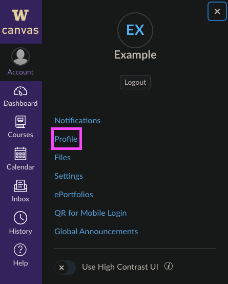
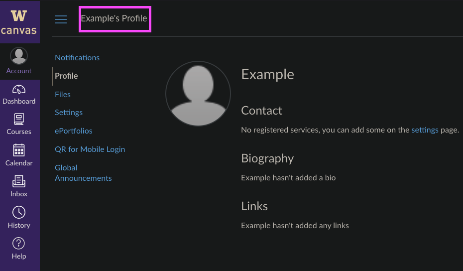
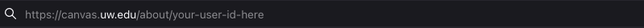
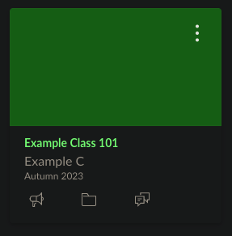
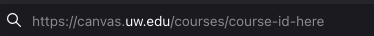
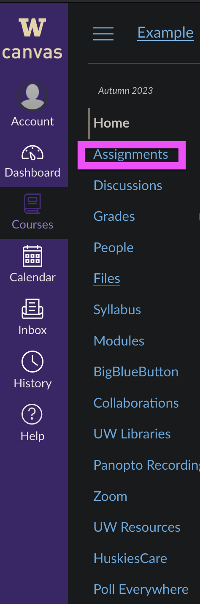
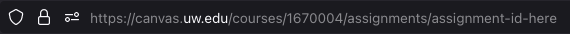

# Pyvas

## Table of Contents
- [Overview](#overview)
- [Features](#features)
- [Setup](#setup)
- [Usage](#usage)
- [Contributing](#contributing)
- [How to Get User-ID](#user-id)
- [How to Get Course-ID](#course-id)
- [How to Get Assignment-ID](#assignment-id)

## Overview

This bot integrates with the Canvas LMS API to provide functionalities like fetching grades, 
due dates, etc., directly within Discord.

## Features

- Subscribe your use id 
- Subscribe to your course 
- Subscribe to your assignment
- Show all the course you're currently enrolled in.
- Show any assignment's due date that you subscribed. 
- Show any assignment's grade that you subscribed.

## Setup

1. Clone the repository:
2. Set up your own token for Discord by going `bot` and `config.py`.
3. Set up your own token for Canvas API by going `canvas_api` and `config.py`.
4. Inside of `config.py` of `canvas_api`, change `CANVAS_URL` to your own canvas url.

## Usage

- `$substudent <user id>`: Subscribe your user id and password of your choice. Refer [here](#user-id) to learn how to get user id.

- `$subcourse <course name> <course id>` Subscribe your course using name of your choice and course id. Refer [here](#course-id) to learn how to get course id.

- `$subhw <course name> <hw name> <hw id>` Subscribe  your assignment using name of choice and course id. Refer [here](#assignment-id) to learn how to get assignment id.

- `$showcourse `: Show all the courses that you're currently enrolled.

- `$showhwgrade <course name> <assignment name>`: Show the grade of the assignment that you subscribed under `assignment name`.

- `$showhwdue <course name> <assignment name>`: Show the due date of the assignment that you subscribed under `assignment name`.

- `$help`: Show all the commands your can use for this bot.
## Contributing

Feel free to fork the project and submit pull requests! As this being just a personal project, I am not planning to expand features 
much, but you're more than welcome to request as well💯

## How to Get User-ID

1. Sign-in to your canvas.
2. Click the sidebar on the left and select "Account"
3. Under the Account menu, select "Profile" 

4. Once in Profile, select "Your-name's Profile" on upper left.  

5. The URL is now should be changed. The last number is your user id. Copy it.  

## How to Get Course-ID

1. Sign-in to your canvas. 
2. In Dashboard, select the course you want to subscribe to.  

3. The URL is now should be changed. The last numbers in the URL are the course id. Copy it.  

## How to Get Assignment-ID

1. Sing-in to your canvas.
2. In Dashboard, select the course you want to get assignment from.
3. Click "Assignment" selection 

4. The URL is now should be changed. The last numbers in the URL is the assignment id. Copy it.

